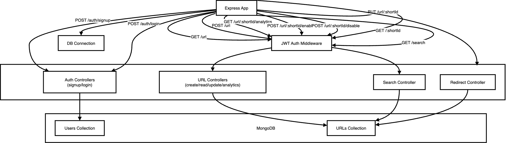

<h1>URL Shortener</h1>

<h2>Table of Contents</h2>
<ul>
  <li><a href="#description">Description</a></li>
  <li><a href="#features">Features</a></li>
  <li><a href="#tech-stack">Tech Stack</a></li>
  <li><a href="#project-setup">Project Setup</a></li>
  <li><a href="#diagram">Diagram Explaination</a></li>
  <li><a href="#endpoints">Endpoints</a></li>
  <li><a href="#documentation">Documentation</a></li>
</ul>

<h2 id="description">Description</h2>

This project is a fully functional URL shortener service built using <b>Node.js</b>, <b>Express</b>, <b>MongoDB</b>, and <b>JWT authentication</b>. 
It allows users to create short links, manage them, and track analytics securely. 
Users must sign up and log in to access most features, ensuring each user's data is private and secure.

<h2 id="features">Features</h2>
<ul>
  <li>User signup and login with JWT authentication</li>
  <li>Create short URLs (random or custom slug)</li>
  <li>Redirect to original URLs using short links</li>
  <li>Track visit history (IP, device, timestamp)</li>
  <li>Disable and enable short URLs</li>
  <li>Update the URLs</li>
  <li>Search URLs in the database</li>
  <li>Secure backend using middleware authentication</li>
</ul>

<h2 id="tech-stack">Tech Stack</h2>
<ul>
  <li>Node.js</li>
  <li>Express.js</li>
  <li>Mongoose</li>
  <li>JWT for authentication</li>
  <li>express-useragent for device tracking</li>
</ul>

<h2 id="project-setup">Project Setup</h2>

<h3>Step 1: Download the Repository</h3>
<pre><code>git clone https://github.com/husainhakim/URL-Shortener.git</code></pre>

<h3>Step 2: Navigate to the Folder</h3>
<pre><code>cd backend</code></pre>

<h3>Step 3: Download the Dependencies</h3>
<pre><code>npm install</code></pre>

<h3>Step 4: Make .env file</h3>
<pre><code>touch .env</code></pre>

<h3>Step 5: Add the following variables to <code>.env</code></h3>
<pre><code>
PORT=
DB_URL= 
JWT_SECRET=
JWT_Expiry_Time=
</code></pre>

<h3>Step 6: Run the Project</h3>
<pre><code>npm start</code></pre>

<h2 id="diagram">Diagram</h2>

  

<h2 id="endpoints">Endpoints</h2>

<table>
  <tr>
    <th>Method</th>
    <th>Endpoint</th>
    <th>Description</th>
    <th>Auth Required</th>
    <th>Example Request Body / Notes</th>
  </tr>
  <tr>
    <td>POST</td>
    <td>/auth/signup</td>
    <td>Register a new user</td>
    <td>No</td>
    <td><pre>{ "Name": "Husain Hakim", "email": "husain@gmail.com", "password": "husain@1234" }</pre></td>
  </tr>
  <tr>
    <td>POST</td>
    <td>/auth/login</td>
    <td>Login an existing user</td>
    <td>No</td>
    <td><pre>{ "email": "husain@gmail.com", "password": "husain@1234" }</pre></td>
  </tr>
  <tr>
    <td>POST</td>
    <td>/url</td>
    <td>Create a new short URL</td>
    <td>Yes</td>
    <td><pre>{ "url": "https://www.google.com", "customSlug": "google" }</pre></td>
  </tr>
  <tr>
    <td>PUT</td>
    <td>/url/:shortId</td>
    <td>Update an existing short URL</td>
    <td>Yes</td>
    <td><pre>{ "url": "https://www.example.com", "customSlug": "newslug" }</pre></td>
  </tr>
  <tr>
    <td>POST</td>
    <td>/url/:shortId/disable</td>
    <td>Disable a short URL</td>
    <td>Yes</td>
    <td>-</td>
  </tr>
  <tr>
    <td>POST</td>
    <td>/url/:shortId/enable</td>
    <td>Enable a short URL</td>
    <td>Yes</td>
    <td>-</td>
  </tr>
  <tr>
    <td>GET</td>
    <td>/url/:shortId/analytics</td>
    <td>Get analytics for a URL</td>
    <td>Yes</td>
    <td>-</td>
  </tr>
  <tr>
    <td>GET</td>
    <td>/url</td>
    <td>Fetch all URLs for the user</td>
    <td>Yes</td>
    <td>-</td>
  </tr>
  <tr>
    <td>GET</td>
    <td>/search?q=&lt;query&gt;&analytics=&lt;true|false&gt;</td>
    <td>Search URLs</td>
    <td>Yes</td>
    <td>-</td>
  </tr>
  <tr>
    <td>GET</td>
    <td>/:shortId</td>
    <td>Redirect to original URL</td>
    <td>No</td>
    <td>Records visit history</td>
  </tr>
</table>

<h2 id="documentation">Documentation</h2>

 Want to view the full documentation on Google Docs Click <a href="https://docs.google.com/document/d/1cc1gW_QO2sfVe7tN0NbxcEdrXDNactshy4GMEYIvUrM/edit?usp=sharing" target="_blank">here</a>.

<h2 >Thank You</h2>
